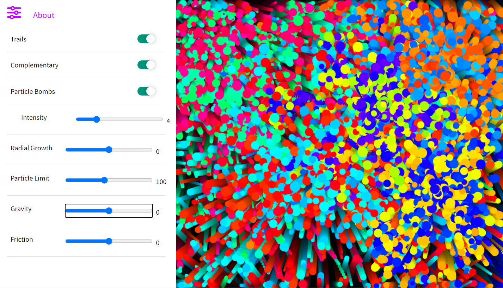

# canvas-creations
A  canvas-based physics exploration.Animation and physics done in JS.

## Installation
 1. Fork this repository
 2. run `git clone <forked_repository_URL>` in bash to initialize a repository on your machine and pull this code
 3. run `npm install` to install dependencies. for other package managers, user their documentatino.
## Running
 There are various ways to get Canvas Creations up and running.
  - run'python -m http.server' in the repository's directory to serve the file on localhost port 8000
  - using VS code live-server (useful for developing)
  - see [npm http-server](https://www.npmjs.com/package/http-server)
## Deployment
 - This site is deployed to github pages [here](https://john-tettis.github.io/canvas-creations/)
 
## Team
  Look at me! I am the captain now...
  
  [John tettis](https://www.linkedin.com/in/john-tettis/) is the solo contributor of this project. He invites you to contribute!

  
